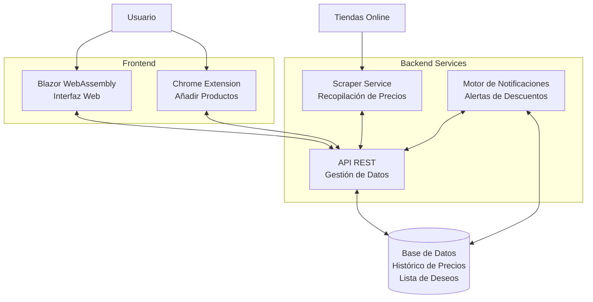

# Descuentor

Descuentor es una aplicación que te permite hacer seguimiento de precios de productos en diferentes tiendas online, notificándote cuando hay descuentos en los artículos que te interesan.

## 🚀 Características Principales

- Seguimiento de precios de los artículos de tu "Lista de deseos"
- Extensión de Chrome para añadir productos fácilmente
- Notificaciones de descuentos
- Histórico de precios
- Soporte para múltiples tiendas online
- Interfaz web intuitiva

## 🛠️ Tecnologías

- Frontend: Blazor WebAssembly
- Backend: ASP.NET Core API
- Scraper: PuppeteerSharp
- Base de datos: PostgreSQL
- Docker para contenerización
- CI/CD con GitHub Actions

## 📋 Prerrequisitos

- .NET 9.0+
- Docker & Docker Compose
- ...

## 🔧 Instalación

```bash
# Clonar el repositorio
git clone https://github.com/miguelalfayate/descuentor.git

# Navegar al directorio
cd descuentor

# Levantar con Docker Compose
docker-compose up -d
```

## 🚀 Guía Rápida de Uso

1. Instala la extensión de Chrome
2. Navega a tu producto favorito en Amazon
3. Click en la extensión para añadir el artículo a tu lista de seguimiento

## 📖 Documentación

Documentación completa disponible en la carpeta `/memoria`.

## 🔄 Arquitectura




Breve descripción de los componentes principales:
- WebUI (Blazor WASM)
- API Backend
- Scraper Service
- Chrome Extension

## 🧪 Tests

```bash
# Ejecutar tests
dotnet test
```

## 📝 Licencia

Este proyecto está bajo la licencia MIT License - ver el archivo [LICENSE.md](link) para más detalles.

## ✒️ Autor

* **Miguel Alfayate** - [miguelalfayate](https://github.com/miguelalfayate/)

## 🎓 Proyecto Académico

Este proyecto fue desarrollado como proyecto final del *Curso de Formación de Grado Superior en Desarrollo de Aplicaciones Multiplataforma*.

## 🔗 Enlaces Útiles

- [Demo en vivo](link)
- [Documentación técnica completa](link)
- [Reportar un bug](link)
