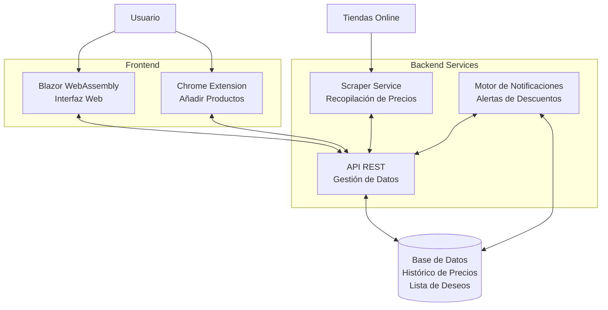

# Descuentor

Descuentor es una aplicación que te permite hacer seguimiento de precios de productos en diferentes tiendas online, notificándote cuando hay descuentos en los artículos que te interesan.

## 🚀 Características Principales

- Seguimiento de precios de los artículos de tu "Lista de deseos"
- Extensión de Chrome para añadir productos fácilmente
- Notificaciones de descuentos
- Histórico de precios
- Soporte para múltiples tiendas online
- Interfaz web intuitiva

## 🛠️ Tecnologías

- Frontend: Blazor WebAssembly
- Backend: ASP.NET Core API
- Scraper: PuppeteerSharp
- Base de datos: PostgreSQL
- Docker para contenerización
- CI/CD con GitHub Actions

## 📋 Prerrequisitos

- .NET 9.0+
- Docker & Docker Compose
- ...

## 🔧 Instalación

```bash
# Clonar el repositorio
git clone https://github.com/miguelalfayate/descuentor.git

# Navegar al directorio
cd descuentor

# Levantar con Docker Compose
docker-compose up -d
```

## 🚀 Guía Rápida de Uso

1. Instala la extensión de Chrome
2. Navega a tu producto favorito en Amazon
3. Click en la extensión para añadir el artículo a tu lista de seguimiento

## 📖 Documentación

Documentación completa disponible en la carpeta `/memoria`.

Índice de las secciones:

1. Introducción
   1. Motivación
   2. Objetivos
   3. Alcance

2. Contexto tecnológico
   1. Análisis de la competencia
   2. Tecnologías existentes
   3. Comparativa de soluciones

3. Análisis y Diseño
   1. Requisitos
          1. Funcionales
          1. No Funcionales
   2. Arquitectura
      1. [Sistema](memoria/3.2-arquitectura/3.2.1-sistema.md)
      2. [Base de Datos](memoria/3.2-arquitectura/3.2.2-base-de-datos.md)
      3. API Endpoints
      4. Integraciones

4. Metodología
   1. Proceso de desarrollo (Git Workflow)
   2. Herramientas
   3. Planificación (Timeline, Risk Assessment

5. Implementación
   1. Frontend
      1. Blazor WebApp
      2. Chrome Extension
   2. Backend
      1. API
      2. Scraper
   3. Seguridad
      1. Autenticación
      2. Gestión de secretos
      3. Protección de datos
   4. Testing
      1. Estrategia
      2. Unit Tests
      3. Integration Tests

6. Despliegue
   1. Entornos
      1. Desarrollo local

      2. Producción

   2. Docker
      1. Configuración
      2. Imágenes

   3. CI/CD
      1. Pipeline
      2. Automatización

   4. Monitorización
      1. Logging
      2. Métricas
      3. Alertas

7. Resultados
   1. Rendimiento
      1. Pruebas de carga

      2. Benchmarks

      3. Optimizaciones

   2. Métricas de uso

   3. Feedback de usuarios

8. Aspectos Legales
   1. Licencias

   2. Privacidad

   3. Términos de uso

   4. GDPR

9. Conclusiones
   1. Objetivos cumplidos

   2. Limitaciones

   3. Trabajo futuro
      1. Mejoras propuestas

      2. Nuevas funcionalidades

10. Anexos
    1. Guías
       1. Instalación
       2. Manual de usuario
       3. Manual de administrador

    2. Mantenimiento
       1. Backups
       2. Actualizaciones
       3. Troubleshooting

    3. Referencias técnicas
       1. API Docs
       2. Configuración del sistema


Bibliografía

## 🔄 Arquitectura




Breve descripción de los componentes principales:
- WebUI (Blazor WASM)
- API Backend
- Scraper Service
- Chrome Extension

## 🧪 Tests

```bash
# Ejecutar tests
dotnet test
```

## 📝 Licencia

Este proyecto está bajo la licencia MIT License - ver el archivo [LICENSE.md](link) para más detalles.

## ✒️ Autor

* **Miguel Alfayate** - [miguelalfayate](https://github.com/miguelalfayate/)

## 🎓 Proyecto Académico

Este proyecto fue desarrollado como proyecto final del *Curso de Formación de Grado Superior en Desarrollo de Aplicaciones Multiplataforma*.

## 🔗 Enlaces Útiles

- [Demo en vivo](link)
- [Documentación técnica completa](link)
- [Reportar un bug](link)
