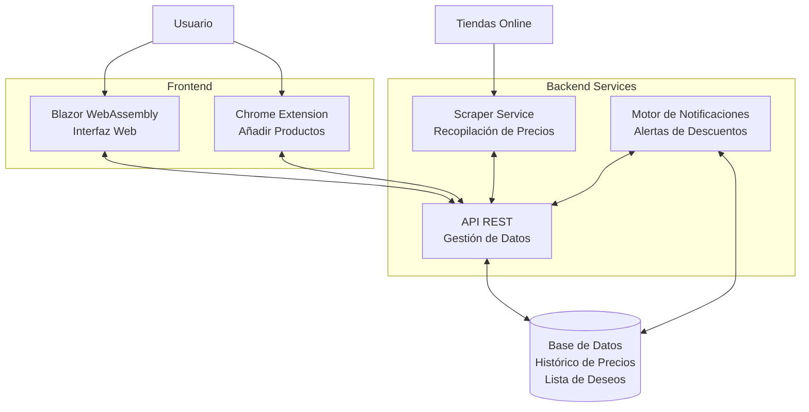
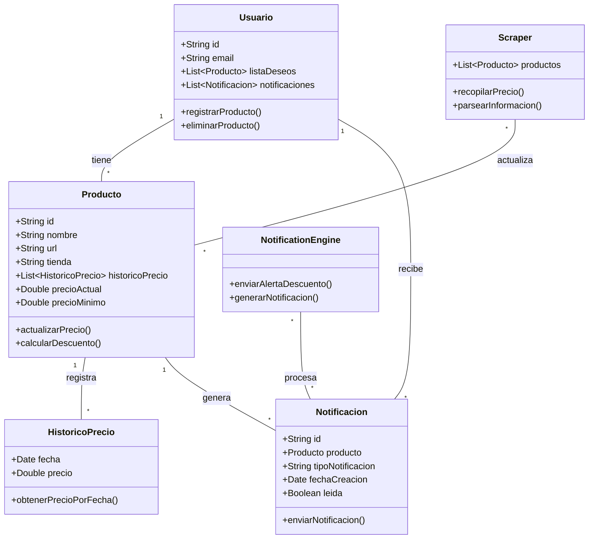

#### 3.2.1. Sistema

**Diagrama de la arquitectura del sistema**:

```mermaid
flowchart TB
    subgraph "Frontend"
        WebUI[Blazor WebAssembly\nInterfaz Web]
        ChromeExt[Chrome Extension\nAñadir Productos]
    end

    subgraph "Backend Services"
        API[API REST\nGestión de Datos]
        Scraper[Scraper Service\nRecopilación de Precios]
        NotificationEngine[Motor de Notificaciones\nAlertas de Descuentos]
    end

    Database[(Base de Datos\nHistórico de Precios\nLista de Deseos)]
    
    WebUI <--> API
    ChromeExt <--> API
    Scraper <--> API
    API <--> Database
    NotificationEngine <--> API
    NotificationEngine <--> Database

    User[Usuario] --> WebUI
    User --> ChromeExt

    Tiendas[Tiendas Online] --> Scraper
```

**Diagrama UML**:

```mermaid
classDiagram
    class Usuario {
        +String id
        +String email
        +List~Producto~ listaDeseos
        +List~Notificacion~ notificaciones
        +registrarProducto()
        +eliminarProducto()
    }

    class Producto {
        +String id
        +String nombre
        +String url
        +String tienda
        +List~HistoricoPrecio~ historicoPrecio
        +Double precioActual
        +Double precioMinimo
        +actualizarPrecio()
        +calcularDescuento()
    }

    class HistoricoPrecio {
        +Date fecha
        +Double precio
        +obtenerPrecioPorFecha()
    }

    class Notificacion {
        +String id
        +Producto producto
        +String tipoNotificacion
        +Date fechaCreacion
        +Boolean leida
        +enviarNotificacion()
    }

    class Scraper {
        +List~Producto~ productos
        +recopilarPrecio()
        +parsearInformacion()
    }

    class NotificationEngine {
        +enviarAlertaDescuento()
        +generarNotificacion()
    }

    Usuario "1" -- "*" Producto : tiene
    Producto "1" -- "*" HistoricoPrecio : registra
    Usuario "1" -- "*" Notificacion : recibe
    Producto "1" -- "*" Notificacion : genera
    Scraper "*" -- "*" Producto : actualiza
    NotificationEngine "*" -- "*" Notificacion : procesa
```

