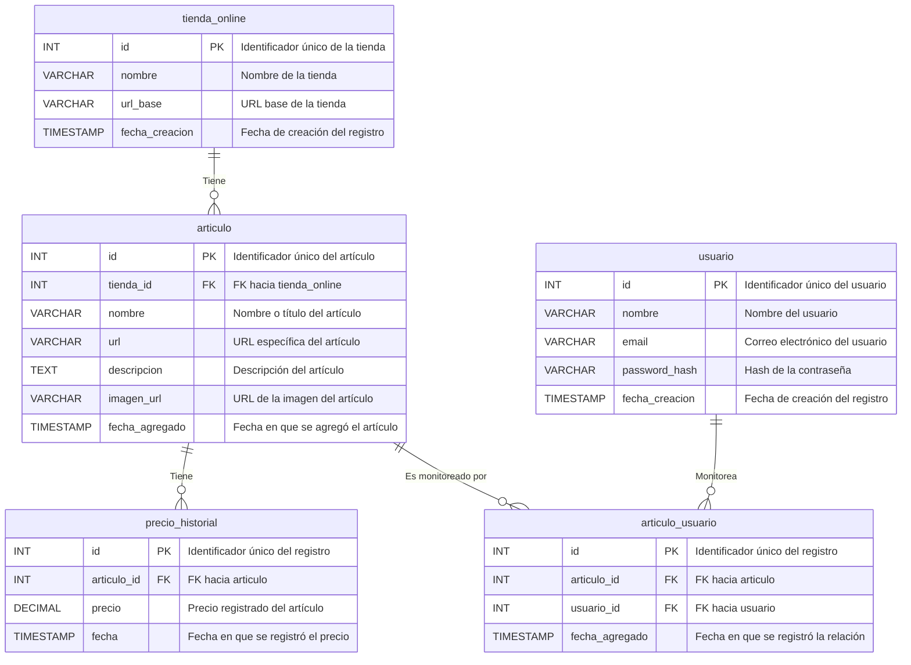

#### 3.2.2 Base de datos

##### **Esquema de Base de Datos**

El siguiente esquema define las tablas principales utilizadas en el sistema de monitoreo de precios. Estas tablas están diseñadas para gestionar artículos, tiendas en línea, precios históricos y usuarios de manera eficiente y escalable.

###### Tabla: `tienda_online`

Esta tabla almacena información sobre las tiendas en línea donde se monitorean los artículos.

| Campo            | Tipo           | Restricciones                           | Descripción                       |
| ---------------- | -------------- | --------------------------------------- | --------------------------------- |
| `id`             | `INT`          | `PRIMARY KEY`, `AUTO_INCREMENT`         | Identificador único de la tienda. |
| `nombre`         | `VARCHAR(100)` | `NOT NULL`                              | Nombre de la tienda.              |
| `url_base`       | `VARCHAR(255)` | `NOT NULL`                              | URL base de la tienda.            |
| `fecha_creacion` | `TIMESTAMP`    | `DEFAULT CURRENT_TIMESTAMP`, `NOT NULL` | Fecha de creación del registro.   |

------

###### Tabla: `articulo`

Contiene los detalles de los artículos que están siendo monitoreados.

| Campo            | Tipo           | Restricciones                              | Descripción                            |
| ---------------- | -------------- | ------------------------------------------ | -------------------------------------- |
| `id`             | `INT`          | `PRIMARY KEY`, `AUTO_INCREMENT`            | Identificador único del artículo.      |
| `tienda_id`      | `INT`          | `FOREIGN KEY REFERENCES tienda_online(id)` | Tienda a la que pertenece el artículo. |
| `nombre`         | `VARCHAR(255)` | `NOT NULL`                                 | Nombre o título del artículo.          |
| `url`            | `VARCHAR(255)` | `NOT NULL`, `UNIQUE`                       | URL específica del artículo.           |
| `descripcion`    | `TEXT`         |                                            | Descripción del artículo.              |
| `imagen_url`     | `VARCHAR(255)` |                                            | URL de la imagen del artículo.         |
| `fecha_agregado` | `TIMESTAMP`    | `DEFAULT CURRENT_TIMESTAMP`, `NOT NULL`    | Fecha en que se agregó el artículo.    |

------

###### Tabla: `precio_historial`

Almacena los precios históricos de cada artículo, permitiendo realizar un seguimiento de los cambios de precio.

| Campo         | Tipo            | Restricciones                           | Descripción                         |
| ------------- | --------------- | --------------------------------------- | ----------------------------------- |
| `id`          | `INT`           | `PRIMARY KEY`, `AUTO_INCREMENT`         | Identificador único del registro.   |
| `articulo_id` | `INT`           | `FOREIGN KEY REFERENCES articulo(id)`   | Artículo relacionado con el precio. |
| `precio`      | `DECIMAL(10,2)` | `NOT NULL`                              | Precio registrado del artículo.     |
| `fecha`       | `TIMESTAMP`     | `DEFAULT CURRENT_TIMESTAMP`, `NOT NULL` | Fecha en que se registró el precio. |

------

###### Tabla: `usuario`

Permite gestionar a los usuarios del sistema que monitorean artículos.

| Campo            | Tipo           | Restricciones                           | Descripción                      |
| ---------------- | -------------- | --------------------------------------- | -------------------------------- |
| `id`             | `INT`          | `PRIMARY KEY`, `AUTO_INCREMENT`         | Identificador único del usuario. |
| `nombre`         | `VARCHAR(100)` | `NOT NULL`                              | Nombre del usuario.              |
| `email`          | `VARCHAR(100)` | `NOT NULL`, `UNIQUE`                    | Dirección de correo del usuario. |
| `password_hash`  | `VARCHAR(255)` | `NOT NULL`                              | Hash seguro de la contraseña.    |
| `fecha_creacion` | `TIMESTAMP`    | `DEFAULT CURRENT_TIMESTAMP`, `NOT NULL` | Fecha de creación del registro.  |

------

###### Tabla: `articulo_usuario`

Tabla de relación para asociar artículos con los usuarios que los monitorean.

| Campo            | Tipo        | Restricciones                           | Descripción                           |
| ---------------- | ----------- | --------------------------------------- | ------------------------------------- |
| `id`             | `INT`       | `PRIMARY KEY`, `AUTO_INCREMENT`         | Identificador único del registro.     |
| `articulo_id`    | `INT`       | `FOREIGN KEY REFERENCES articulo(id)`   | Artículo monitoreado.                 |
| `usuario_id`     | `INT`       | `FOREIGN KEY REFERENCES usuario(id)`    | Usuario que monitorea el artículo.    |
| `fecha_agregado` | `TIMESTAMP` | `DEFAULT CURRENT_TIMESTAMP`, `NOT NULL` | Fecha en que se registró la relación. |

##### Diagrama de la base de datos:

